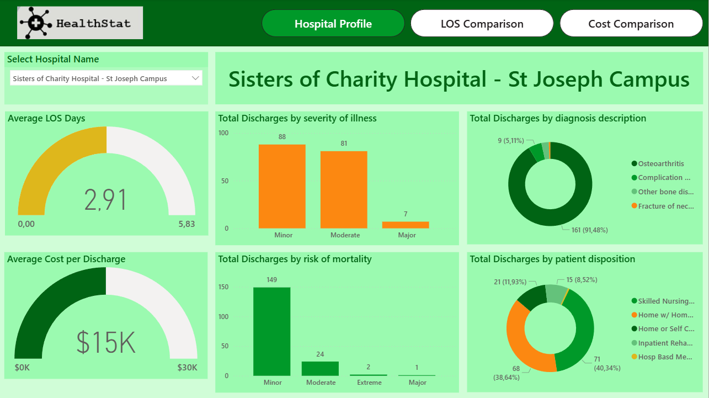

# Healthcare analysis (Power BI)

## 🏥Overview
This Power BI dashboard analyzes hospital efficiency for hip replacement surgeries. It compares hospitals across Length of Stay (LOS), discharges, and costs per discharge, helping identify best practices and inefficiencies.

## 🎯Business Questions
- Which hospitals have the highest and lowest LOS?
- What factors influence LOS and discharge costs?
- How do hospitals compare in terms of cost efficiency?
- Which hospitals can serve as benchmarks for improvement?

## 💡Analysis
**Data Cleaning:** Minimal → renamed headers, adjusted data types, filtered HIP REPLACEMENT cases.
**Key Metrics (DAX):**

- Total Discharges
- Total Hospitals & Surgeons
- Average LOS Days
- Average Cost per Discharge
- % Variance vs Overall Average (LOS & Cost)

## 🔎 Insights
- Severity of illness & mortality risk are the strongest drivers of longer LOS and higher costs.
- NYC hospitals show higher LOS and costs compared to other areas.
- Some hospitals achieve low LOS with low cost, highlighting operational efficiency.
- A few hospitals drive up averages with extremely high LOS (12 days) or high discharge costs ($85.000).

## ✅ Recommendations
- Use efficient hospitals (low LOS + low cost) as benchmarks.
- Investigate NYC hospitals for structural inefficiencies.
- Reduce unnecessary extended stays to optimize both costs and bed availability.

## Visualization

